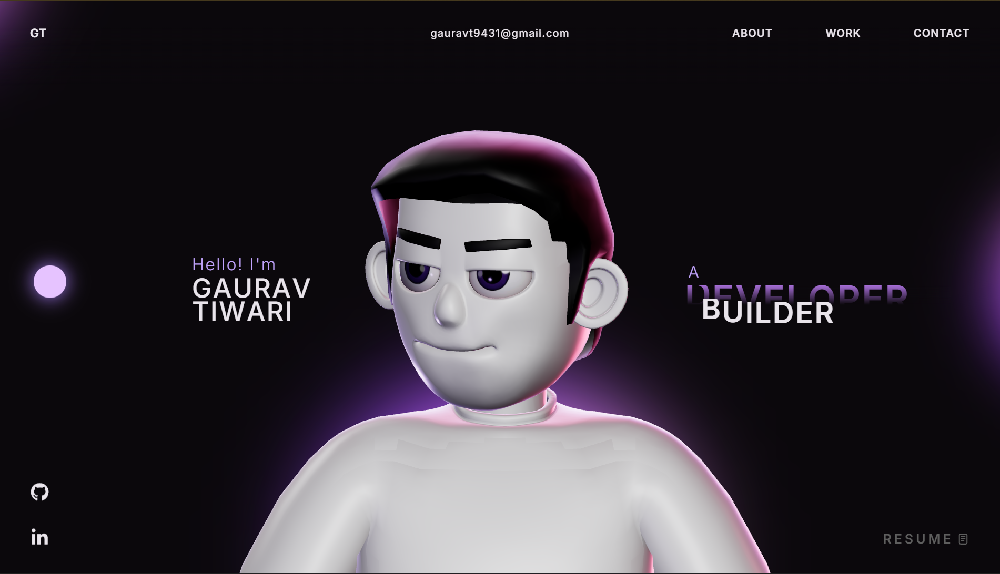

# Gaurav Tiwari — Portfolio

An editorial, WebGL-driven personal site built with React, TypeScript, Three.js and GSAP.



---

## 🎨 Design — "Molten"

Version 2 is a ground-up redesign. Nothing is shared with the previous build.

| | |
|---|---|
| **Palette** | Ink `#0B0B0D` · bone `#EFEBE3` · molten orange `#FF4D19 → #FFA02E` |
| **Display** | Bricolage Grotesque |
| **Editorial accent** | Instrument Serif (italic) |
| **Body** | Space Grotesk |
| **Labels / meta** | JetBrains Mono |
| **Structure** | Ink and bone sections alternate for hard contrast |

The centrepiece is a **blown-glass torus knot wrapped around a molten core**,
caged by two counter-rotating chrome rings — rendered with a transmission
material against a Lightformer studio environment. The name straddles it:
`GAURAV` sits behind the glass as an outline, `TIWARI` in front of it, solid.

A second scene drives the toolkit section — a 14k-point grid displaced by
layered sine waves with a ripple that chases the pointer.

Both scenes degrade on touch and low-core devices (the transmission pass is
swapped for an iridescent metal, point density is halved) and only run while
their section is near the viewport.

---

## ⚙️ Tech Stack

| Category | Technologies |
|---|---|
| **Frontend** | React 18, TypeScript, Vite 5 |
| **3D / WebGL** | Three.js, React Three Fiber, Drei |
| **Animation** | GSAP 3.15 — ScrollTrigger, SplitText |
| **Styling** | Vanilla CSS with custom properties |

Scrolling is native — no transform-based smooth-scroll wrapper — so
`position: sticky` works for the stacked project cards and the timeline rail.

---

## 🗂️ Project Structure

```
├── public/
│   └── screenshots/        # Project imagery
├── src/
│   ├── components/
│   │   ├── three/          # WebGL scenes (Artifact, WaveField)
│   │   ├── styles/         # One stylesheet per component
│   │   ├── Preloader.tsx   # Column-wipe intro + counter
│   │   ├── Nav.tsx         # Header, mobile sheet, live IST clock
│   │   ├── Hero.tsx        # Kinetic name + 3D centrepiece
│   │   ├── Ticker.tsx      # Scroll-reactive marquee
│   │   ├── About.tsx       # Bone section, stats, status card
│   │   ├── Capabilities.tsx# Expanding capability rows
│   │   ├── Timeline.tsx    # Scroll-drawn trajectory rail
│   │   ├── Work.tsx        # Sticky stacked cards, pointer tilt
│   │   ├── Stack.tsx       # Toolkit over the particle field
│   │   ├── Contact.tsx     # Magnetic email + footer
│   │   └── Cursor.tsx      # Difference-blend cursor
│   ├── data/site.ts        # All copy and content in one place
│   ├── lib/                # GSAP setup + shared reveal animations
│   └── index.css           # Design tokens, reset, primitives
├── index.html
└── vite.config.ts
```

All copy lives in [`src/data/site.ts`](./src/data/site.ts) — edit content there
without touching components.

---

## 🚀 Getting Started

**Prerequisites:** Node.js ≥ 18, npm ≥ 9

```bash
git clone https://github.com/Gauravtiwari31/Portfolio.git
cd Portfolio
npm install
npm run dev
```

Available at `http://localhost:5173/`

| Command | Description |
|---|---|
| `npm run dev` | Dev server with HMR |
| `npm run build` | TypeScript check + production build |
| `npm run preview` | Preview the production build |
| `npm run lint` | Run ESLint |

---

## ♿ Accessibility & Performance

- `prefers-reduced-motion` disables the preloader, all reveals, marquee, tilt and magnetic effects
- WebGL scenes mount via `IntersectionObserver` and unmount when scrolled away
- Custom cursor and pointer effects are disabled on coarse-pointer devices
- The preloader has a hard timeout so a background tab can never leave the page locked

---

## 🌐 Deployment

Outputs a static bundle to `dist/`.

- **Vercel** — import the repo, framework auto-detected, deploy
- **Netlify** — build `npm run build`, publish `dist`
- **GitHub Pages** — set `base` in `vite.config.ts`, then deploy `dist`

---

## 📄 Credits & License

Version 1 of this site was adapted from a template by
[Moncy Yohannan](https://moncy.dev). Version 2 — the current build — is an
original design and a full rewrite; no template code remains.

Licensed under the **Personal Portfolio License (PPL) v1.0** — see
[LICENSE](./LICENSE).
